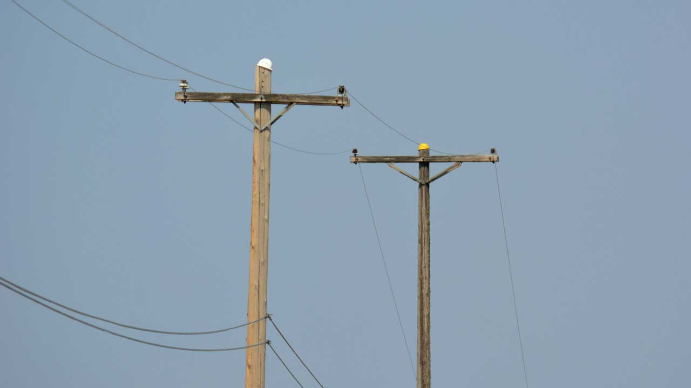
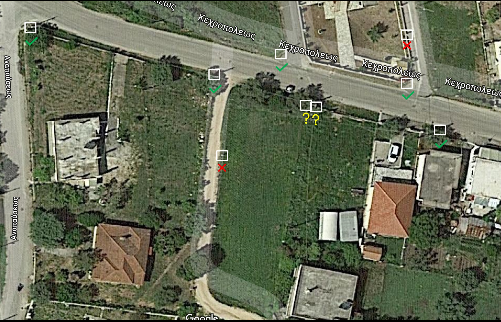

# Wooden-Poles-Object-Detection

AI experiments to automate the process of wooden poles identification using earth-observation imagary.

## Abstract

Advancement of computer vision algorithms, remote sensing, and geospatial technologies allow a continuous monitoring, mapping, and analysis of feature events on the earth. The goal of this project is to build machine learning and computer vision models to help automate the process of wooden poles identification in earth-observation imagary. The process is planned to be deployed in a cloud enviroment where it can be used large scale computer clusters.

## Process

### Intial stage

There has been developed a first PoC (Proof of Concept) product, where there were choosen 3 test areas:

- Palairos
- Tinos
- Kopori

In these areas it was digitized more 3.000 features from different types of sources and used as trained data.

The models that where created, were evaluated using similar test areas.

## Results

The initial results are currently presented in the [docs](./docs) page.

TP (True Positive), FP (False Positive), FN (False Negative)

## Conclusions

There is a lot of work for developing experiments, workflows and deep learning models, so it can be extracted wooden poles positions using imagery data. But the initial results are very promising.
